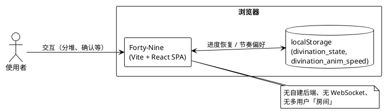
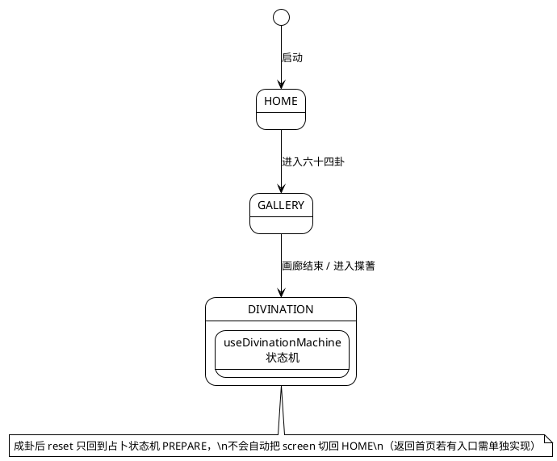
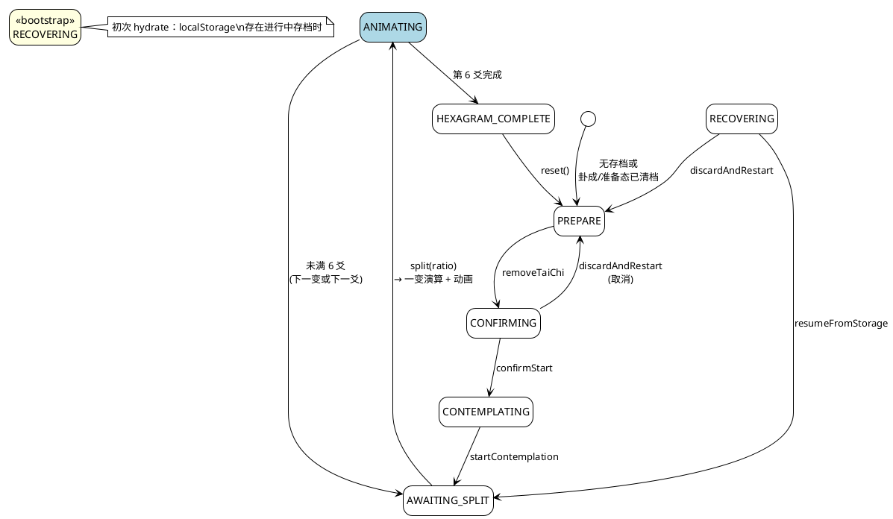
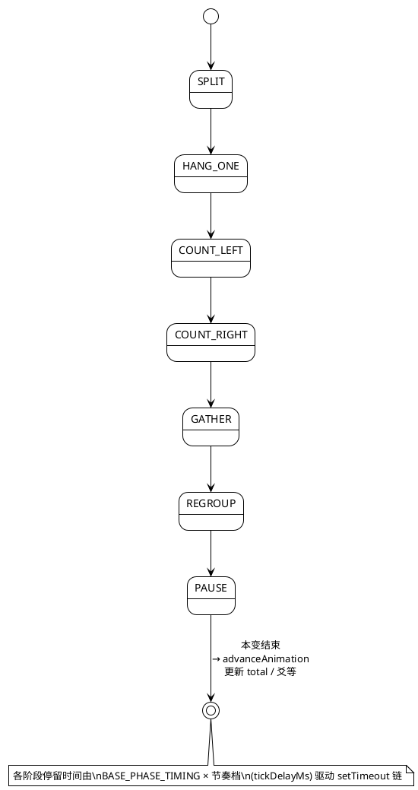
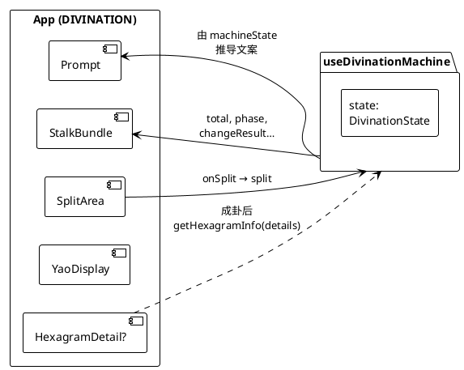
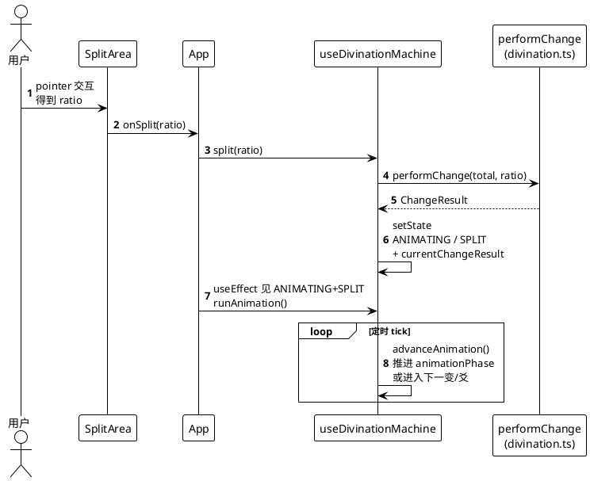
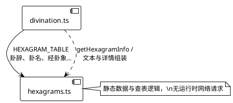

# Forty-Nine 架构说明（PlantUML）

本文用 PlantUML 描述整体结构、状态与关键交互。可在 IDE 中安装 PlantUML 插件预览，或使用 [PlantUML 在线服务](https://www.plantuml.com/plantuml/uml) 粘贴各段 `@startuml` … `@enduml` 渲染。

---

## 1. 系统边界（无后端、单机页内）

不同访客、不同设备之间无共享会话；持久化仅为浏览器 `localStorage`（同域同浏览器配置下多标签页会共用存储键，见代码注释）。



---

## 2. 源码分层与依赖（概览）

```plantuml
@startuml forty-nine-layers
!theme plain
skinparam componentStyle rectangle
skinparam shadowing false

package "入口" {
  [main.tsx] as main
}

package "页面组装" {
  [App.tsx] as app
}

package "components" {
  [StalkBundle]
  [SplitArea]
  [YaoDisplay]
  [Prompt]
  [ConfirmDialog]
  [ContemplationDialog]
  [HexagramGallery]
  [HexagramDetail]
  [HomeIntro]
}

package "hooks" {
  [useDivinationMachine] as hook
}

package "engine" {
  [divination.ts] as div
  [hexagrams.ts] as hex
}

package "types" {
  [types.ts] as types
}

main --> app
app --> hook
app --> div
app --> components

hook --> types
hook --> div
div --> hex
div --> types

components ..> types : 部分通过 props\n间接使用结构
@enduml
```

---

## 3. 应用内三屏流程



---

## 4. 占卜主状态机（`MachineState`）

类型中另有 `CHANGE_COMPLETE`，当前实现未作为独立 `machineState` 使用；实际转移由 `ANIMATING` 内 `advanceAnimation` 在「三变结束」时直接写入下一 `AWAITING_SPLIT` 或 `HEXAGRAM_COMPLETE`。



---

## 5. 揲蓍动画子阶段（`animationPhase`，仅在 `ANIMATING`）



---

## 6. `DIVINATION` 屏主要组件与数据（简化）



---

## 7. 时序：用户完成一次「分而为二」到进入动画



---

## 8. 可选：六十四卦数据与查表



---

## 图的选择说明

| 图 | 用途 |
|----|------|
| 1 系统边界 | 说明「纯前端 + localStorage」，避免误解有多用户后端 |
| 2 分层依赖 | 新人快速定位 `App` / `hooks` / `engine` / 组件职责 |
| 3 三屏 | `HOME` / `GALLERY` / `DIVINATION` 与路由式切换关系 |
| 4 主状态机 | 产品流程与恢复、取消、成卦的核心契约 |
| 5 动画子阶段 | 与 `types.AnimationPhase` 及 `advanceAnimation` 对齐 |
| 6 组件与状态 | DIVINATION 主界面谁读谁写状态 |
| 7 时序 | 一次 `split` 到 `runAnimation` 闭环 |
| 8 引擎数据 | 卦象数据从哪里来 |

若后续增加后端或账号体系，应增补 **部署图** 与 **鉴权 / 会话** 时序图；当前仓库不必画 C4 容器级多服务图。
