# Forty-Nine 架构说明

本文提供 **PlantUML** 与 **Mermaid** 两套等价图示。

- **PlantUML**：可在 IDE 安装插件预览，或粘贴到 [PlantUML 在线服务](https://www.plantuml.com/plantuml/uml)（`@startuml` … `@enduml`）。
- **Mermaid**：GitHub、GitLab、多数文档站与 VS Code 预览原生支持 ```mermaid 代码块；亦可使用 [Mermaid Live Editor](https://mermaid.live)。

---

## 1. 系统边界（无后端、单机页内）

不同访客、不同设备之间无共享会话；持久化仅为浏览器 `localStorage`（同域同浏览器配置下多标签页会共用存储键，见代码注释）。

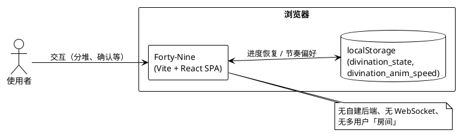

---

## 2. 源码分层与依赖（概览）

```plantuml
@startuml forty-nine-layers
!theme plain
skinparam componentStyle rectangle
skinparam shadowing false

package "入口" {
  [main.tsx] as main
}

package "页面组装" {
  [App.tsx] as app
}

package "components" {
  [StalkBundle]
  [SplitArea]
  [YaoDisplay]
  [Prompt]
  [ConfirmDialog]
  [ContemplationDialog]
  [HexagramGallery]
  [HexagramDetail]
  [HomeIntro]
}

package "hooks" {
  [useDivinationMachine] as hook
}

package "engine" {
  [divination.ts] as div
  [hexagrams.ts] as hex
}

package "types" {
  [types.ts] as types
}

main --> app
app --> hook
app --> div
app --> components

hook --> types
hook --> div
div --> hex
div --> types

components ..> types : 部分通过 props\n间接使用结构
@enduml
```

---

## 3. 应用内三屏流程

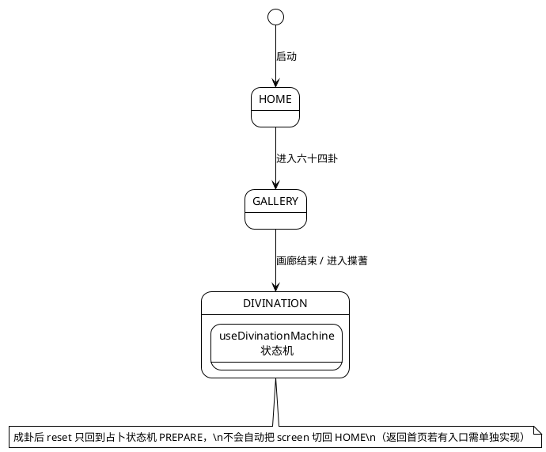

---

## 4. 占卜主状态机（`MachineState`）

类型中另有 `CHANGE_COMPLETE`，当前实现未作为独立 `machineState` 使用；实际转移由 `ANIMATING` 内 `advanceAnimation` 在「三变结束」时直接写入下一 `AWAITING_SPLIT` 或 `HEXAGRAM_COMPLETE`。

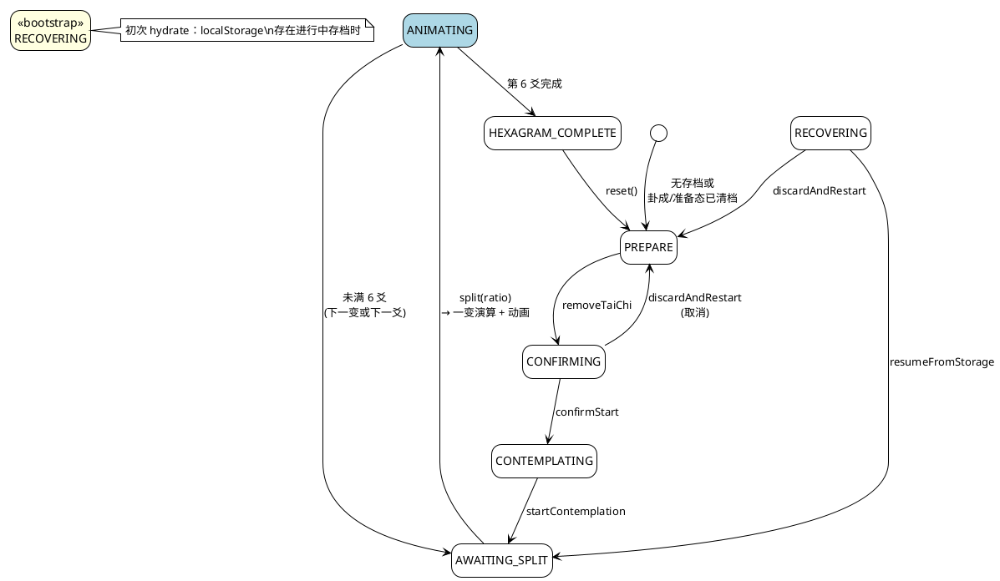

---

## 5. 揲蓍动画子阶段（`animationPhase`，仅在 `ANIMATING`）

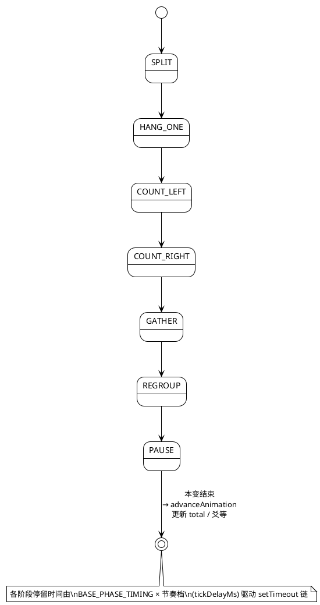

---

## 6. `DIVINATION` 屏主要组件与数据（简化）

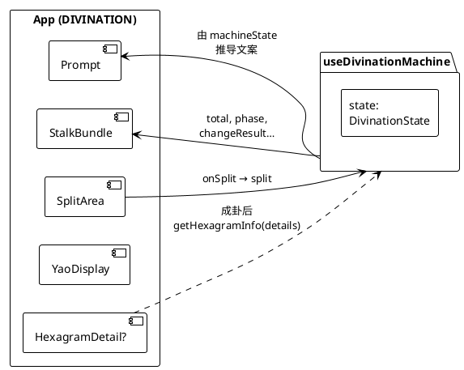

---

## 7. 时序：用户完成一次「分而为二」到进入动画

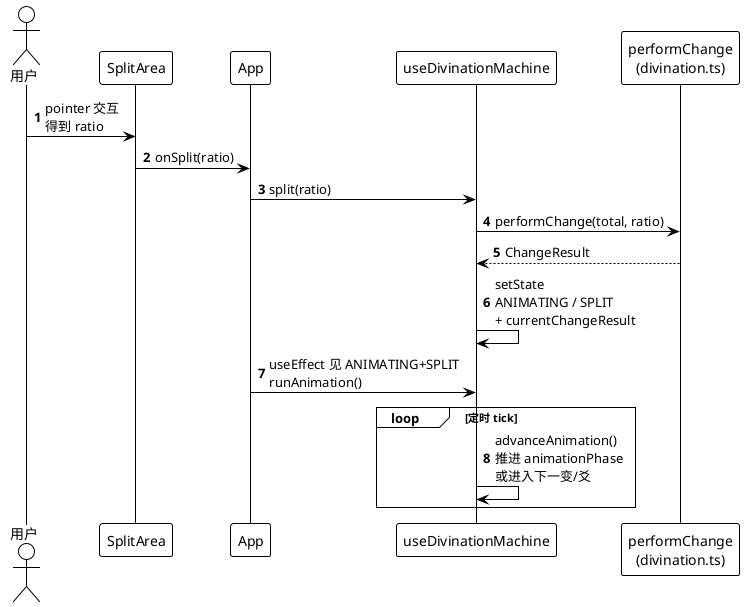

---

## 8. 可选：六十四卦数据与查表

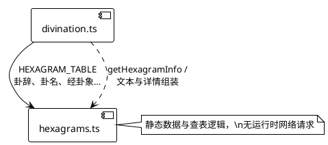

---

## Mermaid 版本（与上文 §1～8 对应）

### M1. 系统边界

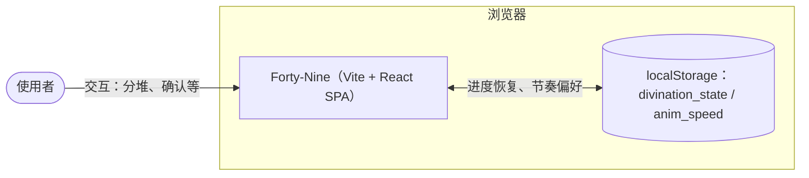

（无后端、无 WebSocket、无多用户房间——同 §1 文字说明。）

### M2. 源码分层与依赖

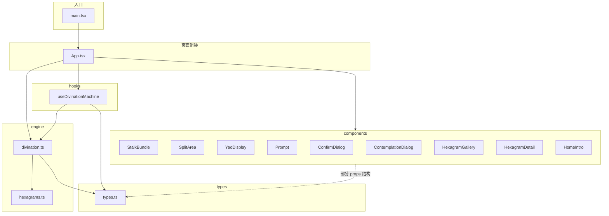

### M3. 应用内三屏流程

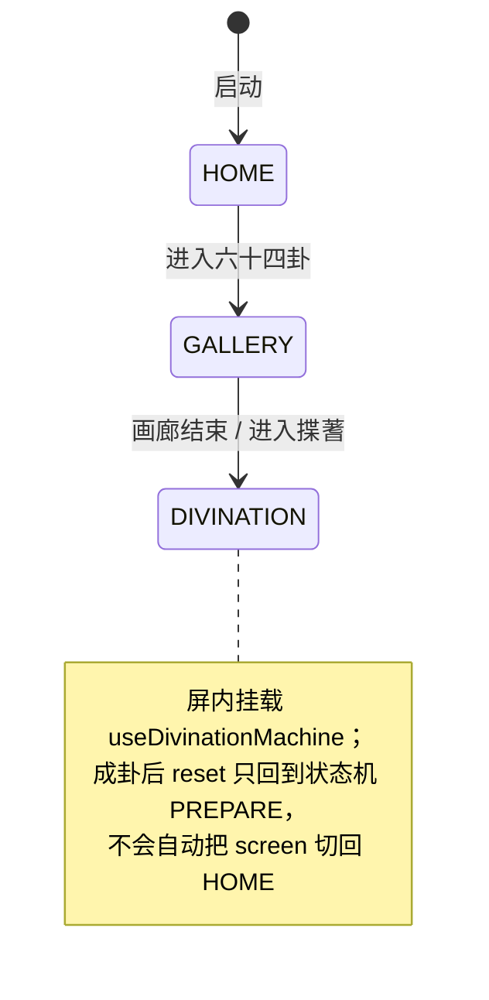

### M4. 占卜主状态机（`MachineState`）

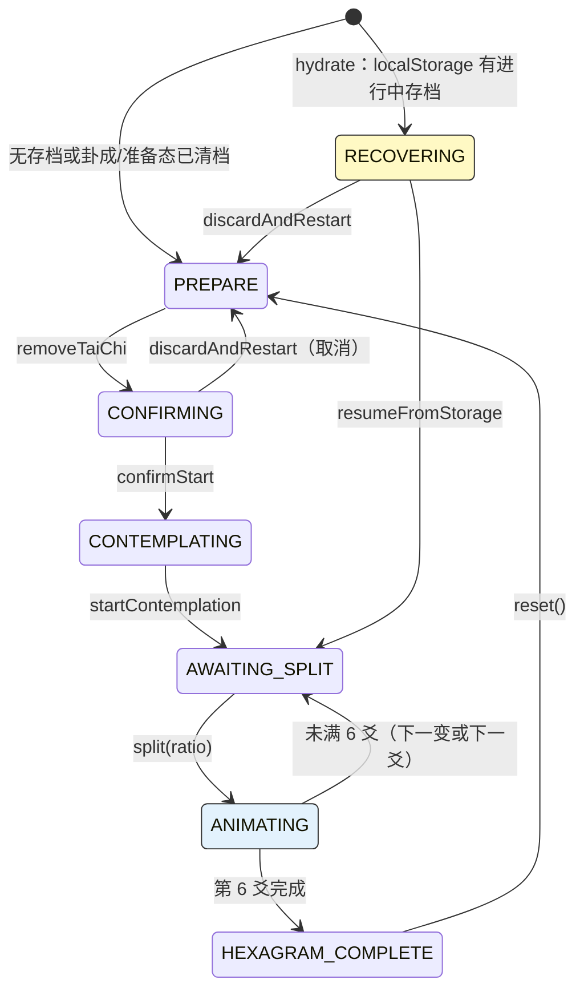

（`CHANGE_COMPLETE` 在类型中存在、当前未作为独立 `machineState` 使用——同 §4。）

### M5. 揲蓍动画子阶段（`animationPhase`）

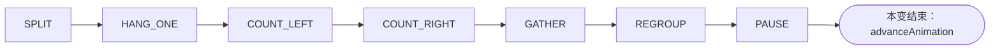

各阶段停留：`BASE_PHASE_TIMING × 节奏档`，由 `tickDelayMs` 与 `setTimeout` 链驱动。

### M6. `DIVINATION` 屏主要组件与状态

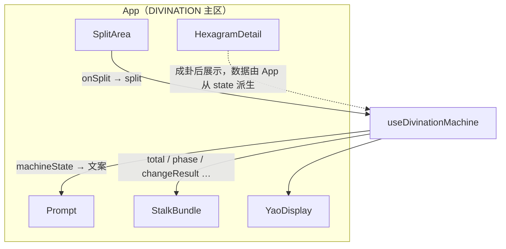

### M7. 时序：一次分堆到进入动画

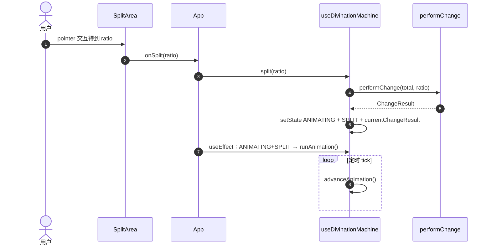

### M8. 六十四卦数据与查表

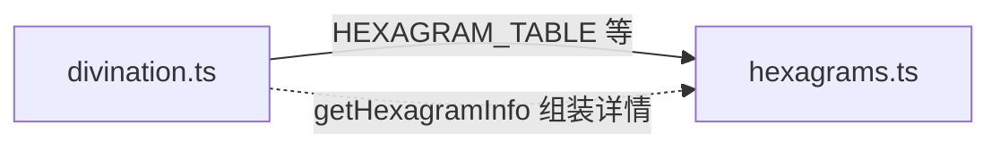

（静态数据与查表，无运行时网络请求。）

---

## 图的选择说明

| 图 | PlantUML | Mermaid |
|----|----------|---------|
| 1 系统边界 | §1 | M1 |
| 2 分层依赖 | §2 | M2 |
| 3 三屏 | §3 | M3 |
| 4 主状态机 | §4 | M4 |
| 5 动画子阶段 | §5 | M5 |
| 6 组件与状态 | §6 | M6 |
| 7 时序 | §7 | M7 |
| 8 引擎数据 | §8 | M8 |

各图用途与上表一致：系统边界、分层、三屏、主状态机、动画子阶段、组件数据流、分堆时序、引擎数据。

若后续增加后端或账号体系，应增补 **部署图** 与 **鉴权 / 会话** 时序图；当前仓库不必画 C4 容器级多服务图。
